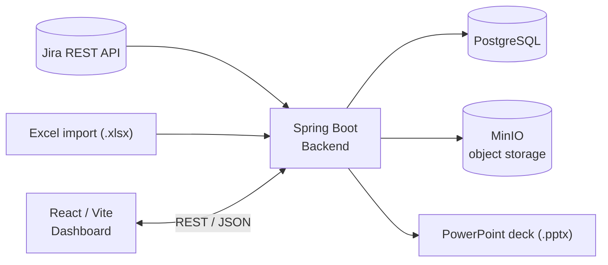

# Scrum Sprint Presentation Maker (with Jira)

> Sprint capacity-planning dashboard that pulls data from Jira, computes team workload, and generates a ready-to-present PowerPoint deck for sprint reviews and planning meetings.


 via Excel import.
3. **Compute** workload vs. capacity per sprint, per team and per person.
4. **Visualise** the results on a web dashboard.
5. **Export** a complete PowerPoint (PPTX) deck with a single click.

It was built as an internal Product Owner tool for the IT / Product Development team at Kazancı Holding (AKSA) and runs as one of the applications behind the company's single-sign-on portal.
<!-- TODO: Şirket adının README'de geçmesini istemiyorsan yukarıdaki cümleyi sil. -->

## Features

- **Jira integration** – sprints, issues, story points, assignees and statuses are fetched directly from the Jira REST API using API-token authentication.
- **Excel import** – upload spreadsheets for capacity / availability data or any input that is not tracked in Jira.
- **Capacity & workload calculation** – planned workload vs. available capacity per sprint, team and team member.
- **Dashboard** – React + Vite front-end for browsing sprints and the computed capacity figures.
- **One-click PPTX generation** – the backend builds a sprint review / planning deck from the computed data.
- **Object storage** – uploaded Excel files and generated presentations are stored in MinIO (S3-compatible).
- **Persistence** – PostgreSQL keeps sprints, teams, capacity records and generated reports.
- **Containerised deployment** – Docker images for each service, deployed to Railway with CI/CD.
<!-- TODO: Uygulamada olmayan bir madde varsa çıkar, olan ama burada yazmayanı ekle. -->

## Architecture



| Layer | Technology |
|---|---|
| Backend | Java, Spring Boot, REST API |
| Frontend | React, Vite |
| Database | PostgreSQL |
| Object storage | MinIO |
| Integrations | Jira REST API, Excel (.xlsx) import |
| Output | PowerPoint (.pptx) generation |
| Infrastructure | Docker, Railway (CI/CD), nginx reverse proxy, cookie-based (httpOnly JWT) SSO |

<!-- TODO: PPTX ve Excel için kullanılan kütüphaneyi ekle (ör. Apache POI). -->

## Getting started

### Prerequisites

- JDK 17 or newer <!-- TODO: pom.xml'deki java.version ile eşleştir -->
- Node.js 18 or newer
- PostgreSQL and MinIO (locally or via Docker)
- A Jira account with an API token

### Configuration

Create a `.env` file (never commit it) or export the variables below.
<!-- TODO: Değişken adlarını application.properties / application.yml ile birebir eşleştir. -->

| Variable | Description |
|---|---|
| `SPRING_DATASOURCE_URL` | JDBC URL, e.g. `jdbc:postgresql://localhost:5432/sprintmaker` |
| `SPRING_DATASOURCE_USERNAME` / `SPRING_DATASOURCE_PASSWORD` | Database credentials |
| `MINIO_ENDPOINT` | MinIO URL, e.g. `http://localhost:9000` |
| `MINIO_ACCESS_KEY` / `MINIO_SECRET_KEY` | MinIO credentials |
| `MINIO_BUCKET` | Bucket used for uploads and generated decks |
| `JIRA_BASE_URL` | Your Jira instance, e.g. `https://yourcompany.atlassian.net` |
| `JIRA_EMAIL` / `JIRA_API_TOKEN` | Jira API credentials |
| `JWT_SECRET` | Secret used to validate the SSO cookie |

### Run the backend

```bash
cd backend
./mvnw spring-boot:run
```
<!-- TODO: Gradle kullanıyorsan `./gradlew bootRun`; klasör adı farklıysa düzelt. -->

The API starts on `http://localhost:8080` by default.

### Run the frontend

```bash
cd frontend
npm install
npm run dev
```

The dashboard is served on `http://localhost:5173` and proxies API calls to the backend.

### Run everything with Docker

```bash
docker compose up --build
```

This brings up the backend, frontend, PostgreSQL and MinIO together.
<!-- TODO: docker-compose.yml yoksa bu bölümü sil. -->

## Deployment

The system is deployed to **Railway** as separate services (frontend, backend, PostgreSQL, MinIO):

- Each push to the main branch triggers a new build and deployment (CI/CD).
- Services communicate over Railway's private network; all secrets are provided as environment variables.
- Automated scripts back up the PostgreSQL schema and data on a schedule.
<!-- TODO: Yedekleme scriptinin yolu (ör. scripts/backup.sh) varsa buraya yaz. -->

## Project structure

```
.
├── backend/            # Spring Boot API – Jira client, capacity calculation, PPTX export
├── frontend/           # React + Vite dashboard
├── scripts/            # PostgreSQL backup scripts
├── docker-compose.yml
└── README.md
```
<!-- TODO: Gerçek klasör yapısıyla değiştir. -->

## Screenshots

<!-- TODO: docs/screenshots/ altına 2-3 ekran görüntüsü ekleyip burada göster:

-->

## License

Internal project – all rights reserved.
